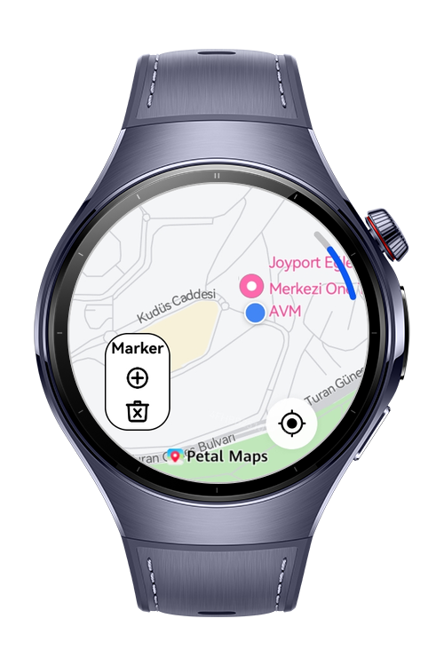
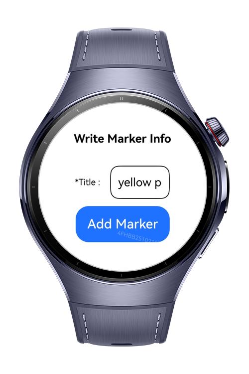
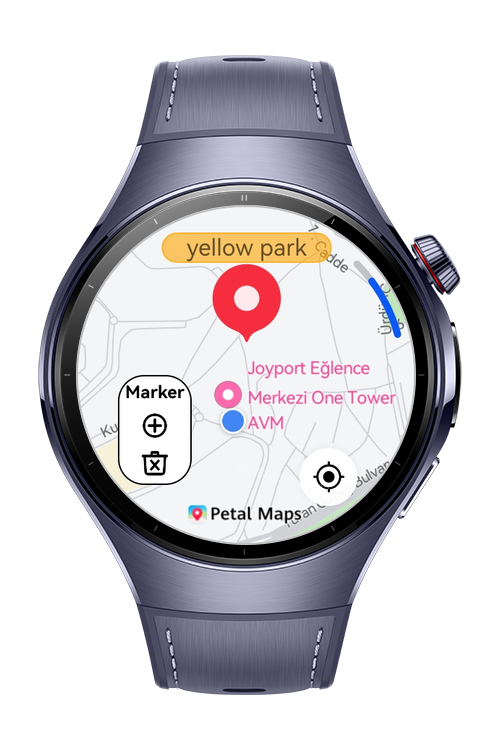
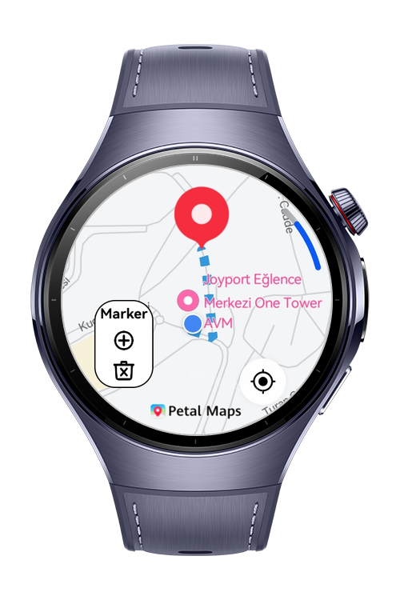

> **Note:** To access all shared projects, get information about environment setup, and view other guides, please visit [Explore-In-HMOS-Wearable Index](https://github.com/Explore-In-HMOS-Wearable/hmos-index).

# ParkPin
ParkPin is a practical location-based app that helps users remember where they parked their car. By using MapKit, LocationKit, and ArkData, the app enables users to save their car's location and navigate back to it effortlessly.

# Preview

<div>
  
  
  
  
</div>

# Use Cases
- Add Marker: After parking the car, tap the “Add Marker” button to store the location. A dialog appears prompting for a Title (required) and an optional Info.
- Persistent Storage: The saved location is stored using ArkData, so it remains available even after restarting the app.
- Marker Display: When the app is launched, the previously saved location is displayed on the map with a marker and info.
- Navigation Support: Tapping on the marker draws a route from the user's current location to the parked car.

# Technology

## Stack
**Languages**: ArkTS

**Frameworks**: HarmonyOS SDK 5.1.0(18)

**Tools**: DevEco Studio Vers  5.1.1.850

**Libraries**: @kit.MapKit, @kit.LocationKit, @kit.ArkUI, @kit.ArkData,


## Required Permissions

- `ohos.permission.LOCATION` ,
- `ohos.permission.APPROXIMATELY_LOCATION`


# Directory Structure
```
entry/src/main/ets/
│
├── pages/
│   └──Index.ets                   # Map and main page
│
├── utils/
│   ├── Constants.ets               # Permission list
│   └── MediaTools.ets              # Location helper functions
│
├── viewmodel/
│   └── DrawRouteModel.ets          # Generate route between start and end locaitons
│
├── entryability/
│   └── EntryAbility.ets            # App ability definition / startup
│
├── module.json5                    # App metadata, permissions
└── build-profile.json5             # Build, signing, and SDK info
```

# Constraints and Restrictions

## Supported Device
- Huawei Watch 5

# License

ParkPin is distributed under the terms of the MIT License.

See the [LICENSE](/LICENSE) for more information.
